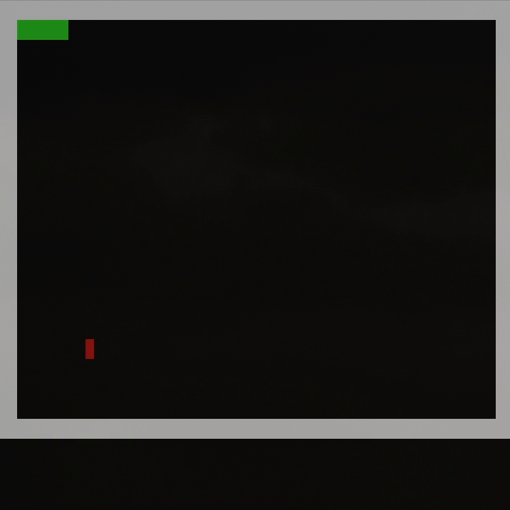

# Snake-C
### This is the classic game of snake written in C meant for the terminal!

## How to Run
- Build game by typing 'make' in terminal
- Use 'make run' to play the game
- Use 'make clean' to remove the game from folder

## Bugs
- userInput "w, a, s, d", is displayed next to the apple when game is running

## Todo
- Implementing collision with the snake itself

## Demo
